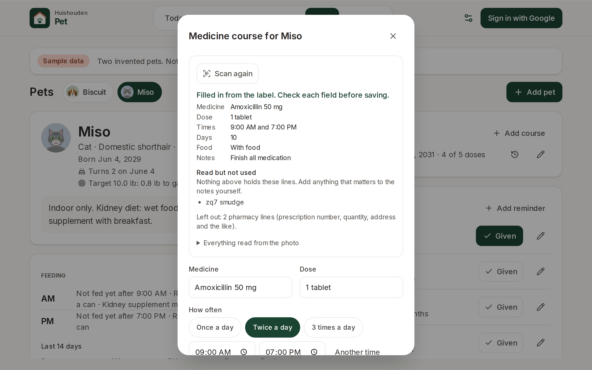
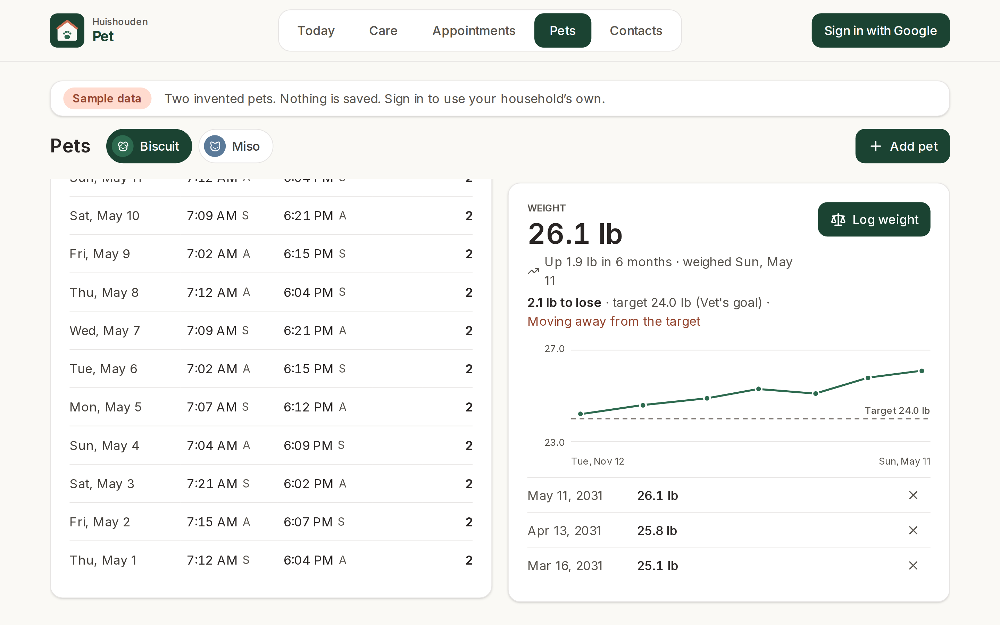

# Huishouden Pet

Looking after the pets, together.

Open it and the first thing you see answers "what needs doing for the pets right now?": every
medicine dose, meal and care reminder that is due or late, most overdue first, each with one tap
(Given, Fed) and Undo. When nothing is due it says so, and what is next. Below that are the rest of
today, what is coming up (care due soon, visits, birthdays within three months), the day's feeding
and medicine board, and the pets; tap a pet for its page, which holds its profile, weight, records,
medicine courses and care. On a pet's birthday, Today and its page celebrate. Everyone in the
household sees and updates the same.

Live at https://huishouden-piekstra.web.app/pet/, also linked from the [Huishouden portal](https://huishouden-piekstra.web.app). The old address, huishouden-pet.web.app, redirects there.
Installable on the tablet, phones and laptops, and works offline (changes sync when the connection is back).

## Screenshots

| Today | Phone |
|---|---|
|  |  |

| A pet | Birthday |
|---|---|
|  |  |

| Care | |
|---|---|
|  | |

| Appointments | Contacts |
|---|---|
|  |  |

| New reminder | Import from calendar |
|---|---|
|  |  |

| Scan the label | Weight and target |
|---|---|
|  |  |

_Screenshots of the live site signed out, which shows two invented pets dated in 2031. Refreshed by CI after each deploy._

## Data

Signed-in members of a Huishouden household read and write under `households/{householdId}`. Every
document carries exactly the fields below (`FIELDS` in `src/lib/model.ts`); the project's rules
accept nothing else.

| Collection | Fields |
|---|---|
| `petProfiles` | name, species, breed, birthDate, weightUnit, targetWeight, targetNote, notes, createdAt, updatedAt, by |
| `petMeals` | petId, name, time (`HH:MM`, after which an unticked meal is late), food, portion, note, createdAt, updatedAt, by |
| `petFeedings` | petId, mealId, at, portion, note, by, createdAt, updatedAt |
| `petMedCourses` | petId, name, dose, timesPerDay, times, startDate, days, withFood, notes, createdAt, updatedAt, by |
| `petMedDoses` | petId, courseId, slot, at, skipped (a dose skipped rather than given: handled, not counted as given), by, createdAt |
| `petPhotos` | data, updatedAt, by (id = the pet's id; `data` a WebP or JPEG data URL under 60 000 characters, from `@huishouden/pwa-kit/photo`, kept apart from the profile so reading the pets stays light) |
| `petReminders` | petId, kind, title, every, unit, due, lastDoneAt, notes, dismissedAt (never due again until restored), createdAt, updatedAt, by |
| `petDoses` | petId, reminderId, title, at, by, createdAt |
| `petAppointments` | petIds, kind, title, at, location, notes, contactId, calendarEventId, calendarLink, createdAt, by |
| `petWeights` | petId, at, value, unit, by, createdAt |
| `petRecords` | petId, title, date, text, createdAt, updatedAt, by |

The daily board is not stored: it is today's feeds and doses, so it starts empty each morning.
Yesterday switches it to the day before, and a course's "Doses by day" lists every day from its
start; ticking an earlier day logs the feed or dose at its own time that day (a dose's time can be
changed after). A course saved with a start date in the past offers to mark the doses already
given. A course day is complete when all its doses were given (a skipped one isn't). New
pets start with an AM and a PM meal. Contacts live in the household-wide `contacts` collection
shared by every app (`@huishouden/pwa-kit/contacts`); Pet shows those whose `apps` include `pet`.
The Firestore rules live in the repo that owns the project's rules file
([huishouden/rules](https://github.com/huishouden/rules)). Signing in uses Google with no extra
scopes; the household comes from the shared `households` document, so one invite from the portal
opens every Huishouden app.

Scan the label reads a medicine label photo on the device (`@huishouden/pwa-kit/dose`, tesseract.js
loaded on first use) and fills in the course for the person to check; the photo is never stored or
uploaded. Medicine doses, meals nobody has ticked by their time and each pet's next birthday (9:00
on the day; not for an approximate birth date) become reminders in the
household's `reminders` collection (`@huishouden/pwa-kit/reminders`), which the shared sender
delivers as notifications to each member who turned them on for a device (Care, "Notifications on
this device", shown once the repo has `VITE_VAPID_PUBLIC_KEY`).

Pet also publishes to the household agenda (`households/{householdId}/agenda`, app `pet`, through
`@huishouden/pwa-kit/agenda`), which the portal shows as one calendar and a Today view. Every member
can read it, so it carries titles, pet names, places and doses, never notes:

| Kind | From | Status |
|---|---|---|
| `appointment` | each appointment at its time, with its place; `who` is the pet, or the pets joined | none |
| `due` (all day) | each care reminder's next due day ("Heartworm prevention for Pepper"), with how often ("Every month"); not a given one-off | `upcoming`, `overdue` once the day has passed |
| `medicine` (all day) | each course ("Antibiotic for Pepper"), one item from its first day through its last ("1 tablet, twice a day, with food"), for the calendar; with no status, the portal's Today leaves it out | none |
| `medicine` | today's and tomorrow's doses at their times ("Antibiotic for Pepper", the dose as the detail), ref `dose:<courseId>:<day>:<slot>` | `done` once given, else `upcoming` |
| `birthday` (all day) | a pet's next birthday within 180 days ("Pepper turns 5"); not for an approximate birth date | none |
| `feeding` | today's and tomorrow's meals at their times ("Feed Pepper · AM"), with food and portion as the detail when set, ref `meal:<mealId>:<day>` | `done` once fed that day, else `upcoming` |

Items cover 30 days back to 180 days ahead (overdue reminders whatever their age) and link to
Today (meals and doses), `?tab=care`, `?tab=appointments` or `?tab=pets&pet=<id>`. Logs (doses given, feeds, weights,
records) stay in the app. Opening the app, and each new day, reconciles everything once every list
has loaded; after that, two seconds after changes settle, each changed record's items are replaced
(a tick on a meal or dose reaches the portal within seconds), and a deleted record's removed.
The signed-out sample writes nothing. The mapping is `src/lib/agenda.ts`; the writes are
`src/data/agendaSync.ts`.

Pet also publishes its open care to the household to-do list (`households/{householdId}/todos`, app
`pet`, through `@huishouden/pwa-kit/todos`), which the portal's To-do tab lists with every app's,
at the same moments as the agenda. Each item carries the writes its buttons make, the same Pet's
own buttons make:

| Item | Ref | Done | Cancel |
|---|---|---|---|
| a care reminder due today or overdue, not dismissed ("Flea and tick", the pet as who, due its day, added when the reminder was) | `reminder:<id>` | Given ("Done" for Other): logs a dose (`petDoses/todo-<id>-<due>`) and sets `lastDoneAt`, and a repeating one's next due day from today; admins, members, helpers | Dismiss: sets `dismissedAt`; admins, members and whoever added it |
| each of today's doses of a course not yet given or skipped ("Antibiotic for Pepper", the dose and its time, added when the course was) | `dose:<courseId>:<day>:<slot>` | Given: logs the dose at its own time that day (`petMedDoses/todo-<courseId>-<day>-<slot>`), so an item left over from yesterday never ticks today's | Skip: the same, `skipped: true` |

A course's doses go to admins, members and helpers, or with "Only approved helpers" to admins,
members and those helpers by name; never kids, and Given on care never for kids either (it logs a
dose). A dismissed reminder shows under Dismissed in Care and in the pet's care list, with Restore;
Dismiss is in the reminder's dialog. A skipped dose shows "Skipped" on the board and in "Doses by
day", where Skip sits under each dose not given; a tap on a skipped one undoes it. The mapping is
`src/lib/todos.ts`.

Find in my calendar and Import from calendar read Google Calendar (read-only) through
`@huishouden/pwa-kit/calendar`; Google asks once for permission the first time. Find a business looks
places up on OpenStreetMap (`@huishouden/pwa-kit/places`), only when Search is pressed. A pet's birthday can come
from the calendar too: "Find birthday in my calendar" in the pet's profile, and Import from calendar for
pets without one (or with only an age). An age or year in the title ("turns 5", "born 2027") gives
the year; otherwise Pet asks for an age or the year born, and shows the year a yearly series began
only as a hint, since that is usually when the event was added. A pet with no known birthday can
have an age instead: it is saved as an approximate birth date (`birthDateApprox`), shown as "About 6
years", with no birthday line or reminder.

## Privacy

Household data lives in the household's own Firestore documents, visible only to its members.
To catch problems early, the app sends reports to New Relic (free tier) through
`@huishouden/pwa-kit/observability`: errors (emails, ids, query strings and long numbers removed),
Core Web Vitals and page loads, the app version, device type, and the country and region New Relic
derives from the request; and anonymous usage counts per visit: `log feed`, `give dose`, `give medicine`, `save appointment`, `log weight`, `save medicine course`, and which tab is open. Households are counted by a
hash of the id. No names, emails, entries, free text or precise location, and no cookie or stored
id: nothing links one visit to the next. When the browser sends Global Privacy Control or Do Not
Track, usage counts are skipped; errors and speed still go. Local builds, staging and automated
browsers send nothing. The page people see is
[huishouden-piekstra.web.app/privacy](https://huishouden-piekstra.web.app/privacy); details in pwa-kit
[docs/observability.md](https://github.com/huishouden/pwa-kit/blob/main/docs/observability.md).

## Develop

```sh
bun install          # also enables the pre-commit leak scan
bun run env:pull     # writes .env.local from the repo's VITE_* variables
bun run dev          # http://localhost:3003
bun run lint && bun run test && bunx pwa-design-check && bun run build
bun run e2e          # Playwright smoke and sample-data feature tests against the live site (BASE_URL to override)
bun run screenshots  # README screenshots (SCREENSHOT_DIR to override)
bun run icons        # regenerate the logo and PNG icons
```

Built on [huishouden-pwa-kit](https://github.com/huishouden/pwa-kit) and follows its
[design language](https://github.com/huishouden/pwa-kit/blob/main/DESIGN.md) and
[standard](https://github.com/huishouden/pwa-kit/blob/main/STANDARD.md). Pushes to `main` deploy to
Firebase Hosting (project `huishouden-piekstra`, site `huishouden-pet`), then run the smoke tests and refresh the screenshots.

## License

Source available under [PolyForm Shield 1.0.0](LICENSE): you may use, study and modify this code
for any purpose except providing a product that competes with Huishouden.

Huishouden and its logo are the project's brand; please don't use them for other products.
