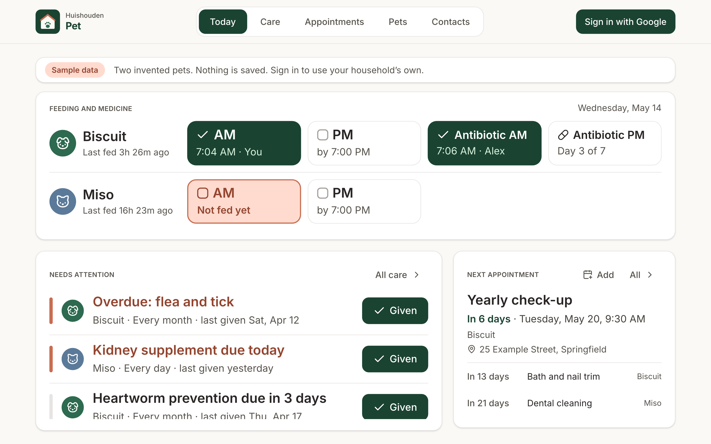
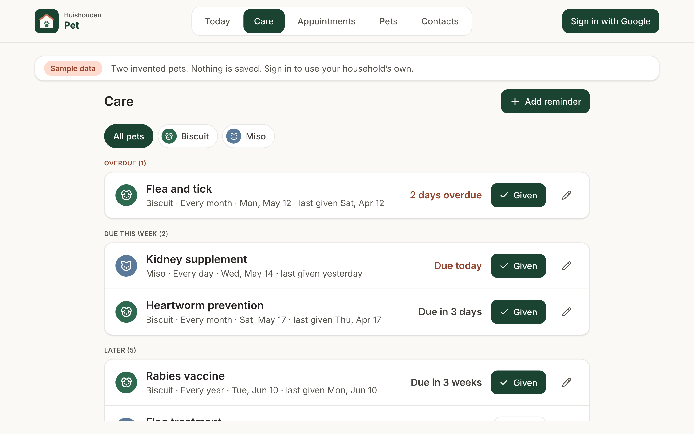
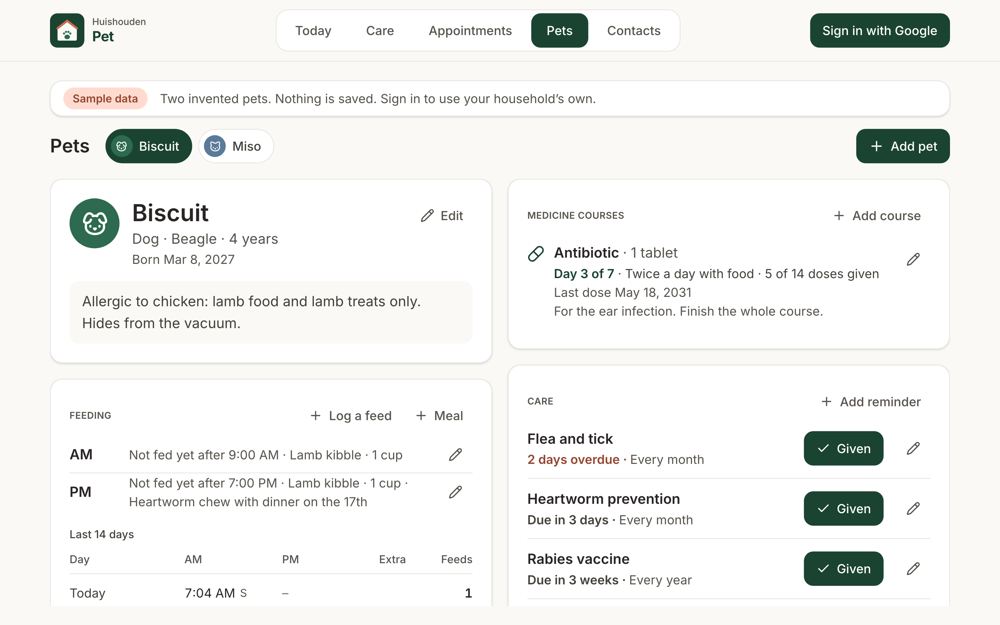
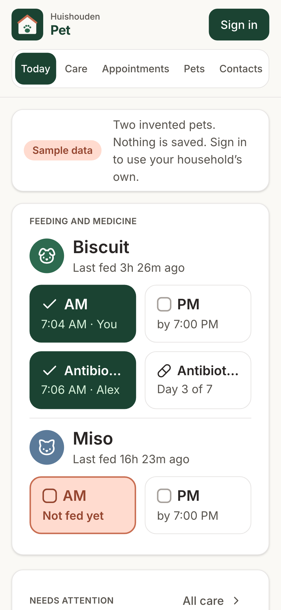
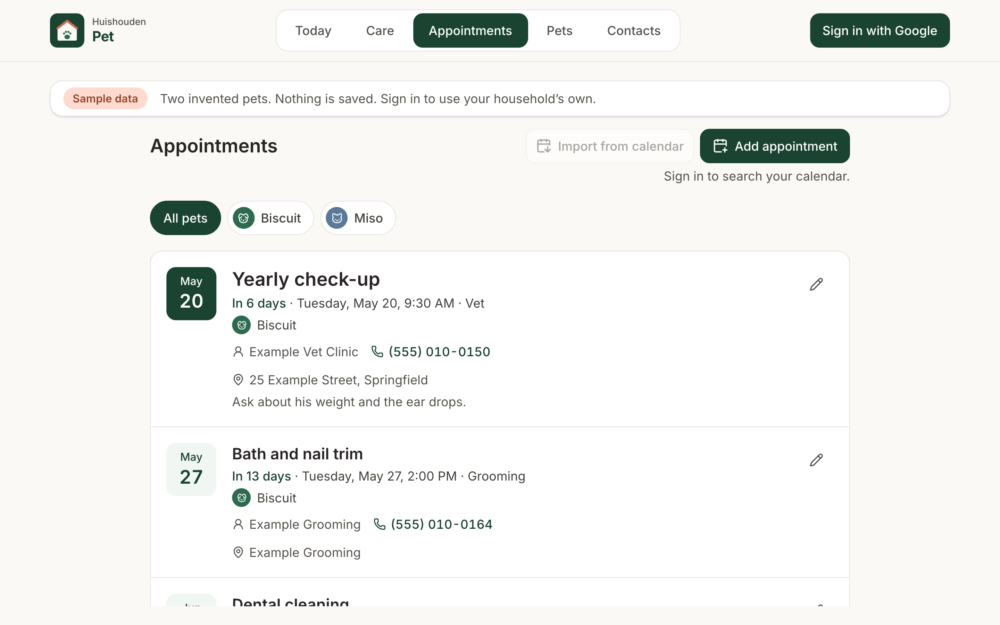
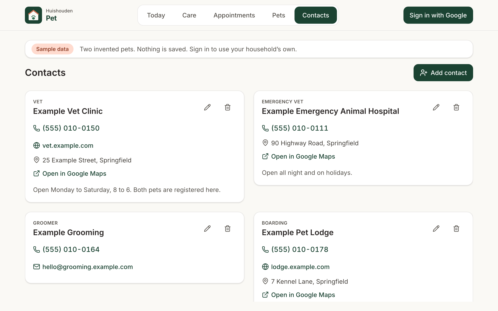
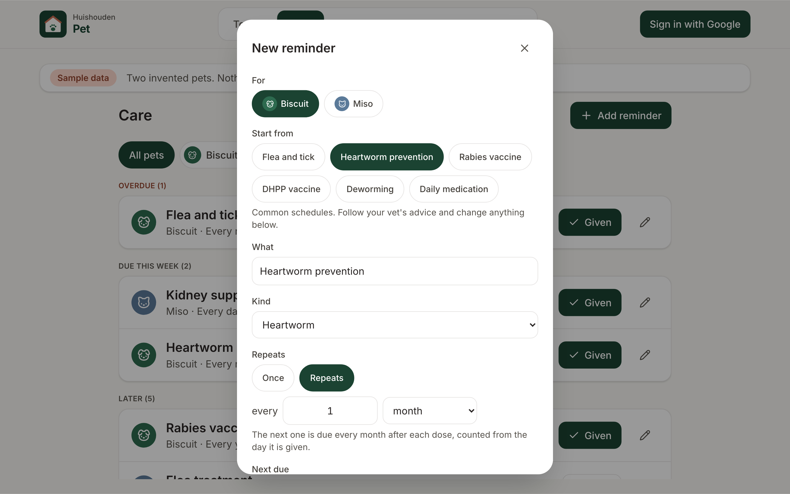
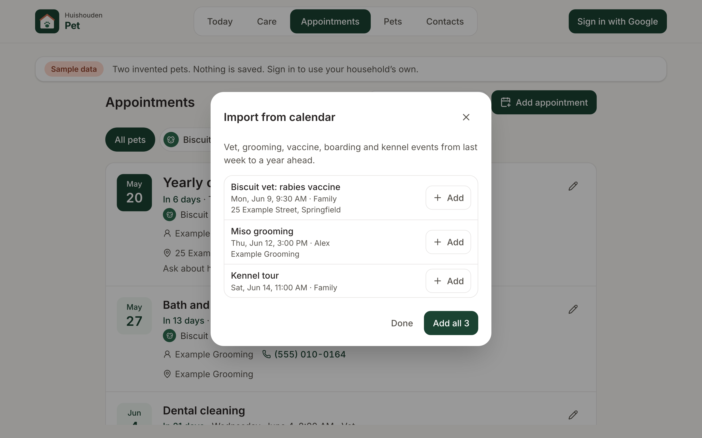

# Huishouden Pet

Looking after the pets, together.

The living-room tablet shows one board for every pet: who has been fed today and by whom, which
medicine doses are given, and anything that is late, in the same place the household used to keep a
paper chart. Below it are the care reminders coming due and the next vet visit. The rest of the app
holds each pet's weight, records and the people who look after them, and everyone in the household
sees and updates the same.

Live at https://huishouden-pet.web.app, also linked from the [Huishouden portal](https://huishouden-piekstra.web.app).
Installable on the tablet, phones and laptops, and works offline (changes sync when the connection is back).

## Screenshots

| Today | Care |
|---|---|
|  |  |

| A pet | Phone |
|---|---|
|  |  |

| Appointments | Contacts |
|---|---|
|  |  |

| New reminder | Import from calendar |
|---|---|
|  |  |

_Screenshots of the live site signed out, which shows two invented pets dated in 2031. Refreshed by CI after each deploy._

## Data

Signed-in members of a Huishouden household read and write under `households/{householdId}`. Every
document carries exactly the fields below (`FIELDS` in `src/lib/model.ts`); the project's rules
accept nothing else.

| Collection | Fields |
|---|---|
| `petProfiles` | name, species, breed, birthDate, weightUnit, notes, createdAt, updatedAt, by |
| `petMeals` | petId, name, time (`HH:MM`, after which an unticked meal is late), food, portion, note, createdAt, updatedAt, by |
| `petFeedings` | petId, mealId, at, portion, note, by, createdAt, updatedAt |
| `petMedCourses` | petId, name, dose, timesPerDay, times, startDate, days, withFood, notes, createdAt, updatedAt, by |
| `petMedDoses` | petId, courseId, slot, at, by, createdAt |
| `petReminders` | petId, kind, title, every, unit, due, lastDoneAt, notes, createdAt, updatedAt, by |
| `petDoses` | petId, reminderId, title, at, by, createdAt |
| `petAppointments` | petIds, kind, title, at, location, notes, contactId, calendarEventId, calendarLink, createdAt, by |
| `petWeights` | petId, at, value, unit, by, createdAt |
| `petRecords` | petId, title, date, text, createdAt, updatedAt, by |

The daily board is not stored: it is today's feeds and doses, so it starts empty each morning. New
pets start with an AM and a PM meal. Contacts live in the household-wide `contacts` collection
shared by every app (`@huishouden/pwa-kit/contacts`); Pet shows those whose `apps` include `pet`.
The Firestore rules live in the repo that owns the project's rules file
([huishouden/tasks](https://github.com/huishouden/tasks)). Signing in uses Google with no extra
scopes; the household comes from the shared `households` document, so one invite from the portal
opens every Huishouden app.

Find in my calendar and Import from calendar read Google Calendar (read-only) through
`@huishouden/pwa-kit/calendar`; Google asks once for permission the first time. Find a business looks
places up on OpenStreetMap (`@huishouden/pwa-kit/places`), only when Search is pressed.

## Develop

```sh
bun install          # also enables the pre-commit leak scan
bun run env:pull     # writes .env.local from the repo's VITE_* variables
bun run dev          # http://localhost:3003
bun run lint && bun run test && bunx pwa-design-check && bun run build
bun run e2e          # Playwright smoke and sample-data feature tests against the live site (BASE_URL to override)
bun run screenshots  # README screenshots (SCREENSHOT_DIR to override)
bun run icons        # regenerate the logo and PNG icons
```

Built on [huishouden-pwa-kit](https://github.com/huishouden/pwa-kit) and follows its
[design language](https://github.com/huishouden/pwa-kit/blob/main/DESIGN.md) and
[standard](https://github.com/huishouden/pwa-kit/blob/main/STANDARD.md). Pushes to `main` deploy to
Firebase Hosting (project `huishouden-piekstra`, site `huishouden-pet`), then run the smoke tests and refresh the screenshots.
